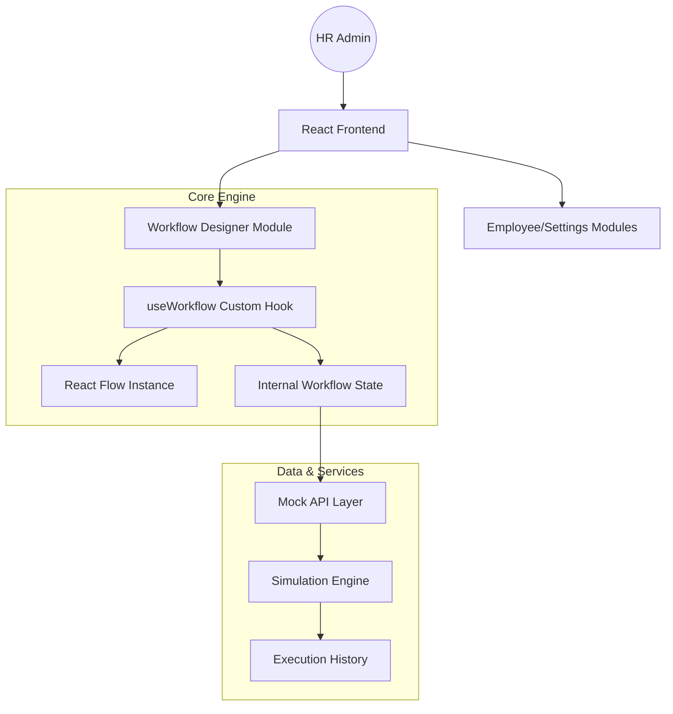
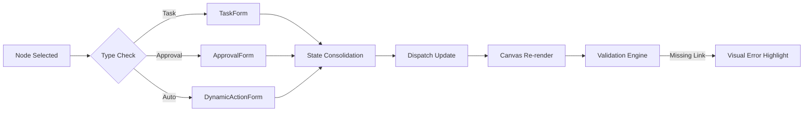

# 🧠 HRFlow Studio: Enterprise Workflow Orchestration

[](https://www.docker.com/)
[](https://reactflow.dev/)
[](https://www.typescriptlang.org/)

## 📝 Executive Summary
HRFlow Studio is a next-generation, visual-first orchestration platform designed to streamline complex HR operations. By leveraging a node-based architecture, it empowers HR administrators to build, validate, and simulate mission-critical workflows—ranging from multi-stage onboarding to sophisticated approval matrices—without a single line of code.

---

## 🖼️ Visual Overview

### System Interface

*The unified dashboard featuring the Workflow Canvas, Component Sidebar, and real-time Sandbox Simulation.*

---

## 🏗️ System Architecture

### 🌐 High-Level Design (HLD)
The system utilizes a decoupled, unidirectional data flow architecture to ensure that the visual representation (Canvas) and the underlying business logic (State/Simulation) remain synchronized but independent.



### 🧬 Low-Level Design (LLD)
Deep-dive into the Node Configuration and Simulation flow.



---

## 🚀 Key Features

### 1. **Adaptive Workflow Canvas**
- **Type-Specific primitives**: 5 specialized node types (Start, Task, Approval, Automated, End).
- **Intelligent Handles**: Connection constraints to ensure logical flow.
- **Visual Validation**: Real-time identification of "dead-end" nodes or disconnected segments with pulse-animation feedback.

### 2. **Polymorphic Configuration Panel**
- **Dynamic Schemas**: Form fields adapt instantly based on node type.
- **API-Driven Automations**: Retrieves dynamic parameter requirements from the `/automations` endpoint to build configuration forms on the fly.

### 3. **High-Fidelity Simulation Sandbox**
- **Dry-Run Mode**: Deserializes the graph state into a sequential JSON execution plan.
- **Cycle Detection**: Advanced safety logic to prevent infinite loops in automated processes.
- **Auto-Scrolling Logs**: Real-time execution history with status tracking.

### 4. **Enterprise Ecosystem**
- **Employee Directory**: Integrated context for assigning tasks and approvers.
- **Global Settings**: Centralized control over workflow thresholds and metadata.

---

## 🛠️ Technical Stack & Implementation Rationale

- **Frontend**: `React 18` + `Vite` — Chosen for its reactive state management and blazing-fast HMR during development.
- **Flow Engine**: `React Flow` — The industry standard for node-based UIs, providing highly performant canvas rendering.
- **Icons & Aesthetic**: `Lucide React` + `Vanilla CSS` — Ensured a "Pixel Premium" look without the bloat of external UI libraries, allowing for complete control over micro-animations.
- **DevOps**: `Docker` + `multi-stage builds` — Ensures identical runtime environments from local dev to production.

---

## 🐞 Challenges Overcome & Unique Solutions

### **The "Phantom Node" Loop Bug**
During development, we encountered a critical issue where the simulation engine would enter an infinite loop when encountering an `AutomatedNode` within a circular flow.
*   **The Solution**: Implemented a **Visited-Set Pattern** in the traversal algorithm. Each node execution is indexed; if the simulation attempts to re-enter a node within the same trace without a terminal exit, it triggers an "Infinite Loop Detected" failstate, preserving system resources.

### **Typescript Polymorphic State Resolution**
Handling diverse node types (`TaskData` vs `StartData`) in a single form component initially caused `Property X does not exist on type Y` errors.
*   **The Solution**: Designed a robust type-guarding system and utilized a flexible `<any>` internal state for the configuration panel, combined with strict casting only at the point of persistence/dispatch.

### **Type-Only ESM Resolution**
Vite's dependency optimizer tripped over runtime imports of TypeScript types from `reactflow`.
*   **The Solution**: Refactored the entire project to use **explicit `import type` declarations**. This optimized the bundle size and resolved silent browser syntax errors that occur when types are treated as values.

---

## 📦 Deployment

### Prerequisites
- Docker & Docker Compose

### Production Setup
```bash
# Build and start the production container
docker-compose up --build

# Application will be live at http://localhost:8080
```

### Local Development
```bash
npm install
npm run dev
```

---

## 🗺️ Roadmap
- [ ] **Multi-user Collaboration**: Real-time edge synchronisation via WebSockets.
- [ ] **Version Control**: Snapshotting workflow history for rollback capability.
- [ ] **Custom Templates**: Pre-configured nodes for common HR tasks (e.g. "I-9 Verification").

---
**Developer Signature:** *SOURISH*
